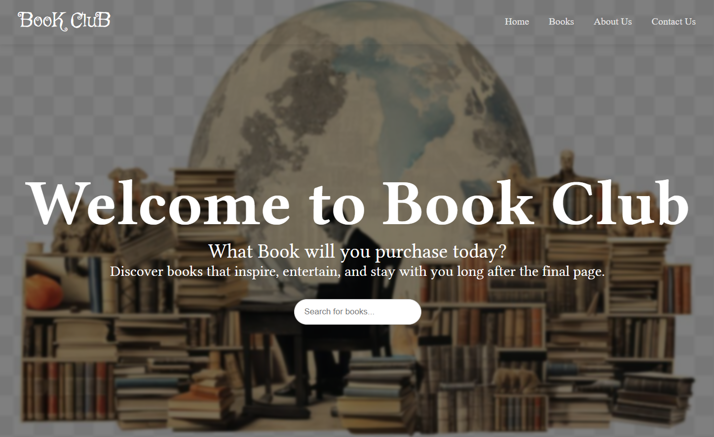

## BOOKCLUB

## Overview
        BookClub is A modern online bookstore built with Next.js that makes it easy for readers to discover, explore, and purchase both physical and digital books. The platform offers a carefully curated collection across multiple genres, with dedicated book pages that provide detailed information about each title. It is designed to create a simple and enjoyable browsing experience while making it easy to expand with features such as filtering, pagination, and a future online purchasing system.
## Screenshot

## Technology Used
    Next.js 14+ - React framework with App Router
    React 18+ - UI library
    TypeScript - Type-safe JavaScript
    Tailwind CSS - Utility-first CSS framework
    Open Library API - Free book data API
    Framer Motion - Smooth animations (optional)
## Get Started

## Prerequest
       -- Node.js (v18.0.0 or higher)
        --npm or yarn or pnpm
        --A modern web browser (Chrome, Firefox, Edge, Safari)
        --Optional but recommended: A code editor (VS Code)
## Installation
    1.Clone the repo:
        git clone https://github.com/EkramJemalH/Book_Club_02.git
    2.Navigate to the project directory
        cd book-club
    3.Install dependencies
        npm install
    4.Run the development server
        npm run dev
    5.View the app
       -- Open your browser and navigate to: http://localhost:3000
       --The app will automatically open with hot-reload enabled
 ## How to Use
        Once the app is running, use the navigation bar to:

### Browse Books
        Home Page: View featured books and browse by category
        Books Catalog: Browse all available books with search and filter options
        Categories: Explore books by genre and subject

### Search & Discovery
    Search Bar: Search for specific titles or authors
    Filters: Narrow down results by:
            Genre/Category
            Publication year
            Book format

### Shopping Cart
    Add to Cart: Click the "Add to Cart" button on any book
    Remove from Cart: Remove items from your cart
    View Cart: See your current selections
    Manage Quantity: Update quantities in your cart
### About Page
    Learn more about the book club
    Contact information
    Store policies and information
## Contact Us 
    form for the user to send message or feedback
## Data Source
        This project pulls book data from the Open Library API (https://openlibrary.org/developers/api). No API key or authentication is required to query the Open Library endpoints used by this app.

## Routes
The application exposes the following routes (based on the `app/` folder layout):

    - `/` — Home / featured books
    - `/about` — About page
    - `/books` — Books listing
    - `/books/[id]` — Book detail page (dynamic route)
    - `/contact` — Contact page / form
    - `/privacy` — Privacy page
    - `/terms` — Terms page

## Key Features / Components
    - Search and filtering -  Allows users to search for books and filter them by genre or category.
    - Books grid and cards - Displays books in a clean, organized grid with reusable cards for each book.
    - Book detail page and not-found fallback  — Provides detailed information about individual books and a helpful page when a book cannot be found.
    - Data & service layer — Handles fetching and managing book data from the Open Library API.
    - Layout and navigation — Provides consistent page structure and easy navigation throughout the website.
    - Contact form  — Allows visitors to send messages or inquiries through the website.
    - Utilities and types — Contains reusable helper functions and TypeScript types to keep the code organized and maintainable

## What Is Still Unfinished / Next Steps
    -- Complete and polish the book detail page with full book information and a clear purchase option.
    -- Complete the cart page for viewing selected books, updating quantities, and reviewing the total.
    -- Adding email handler for the contact us form
